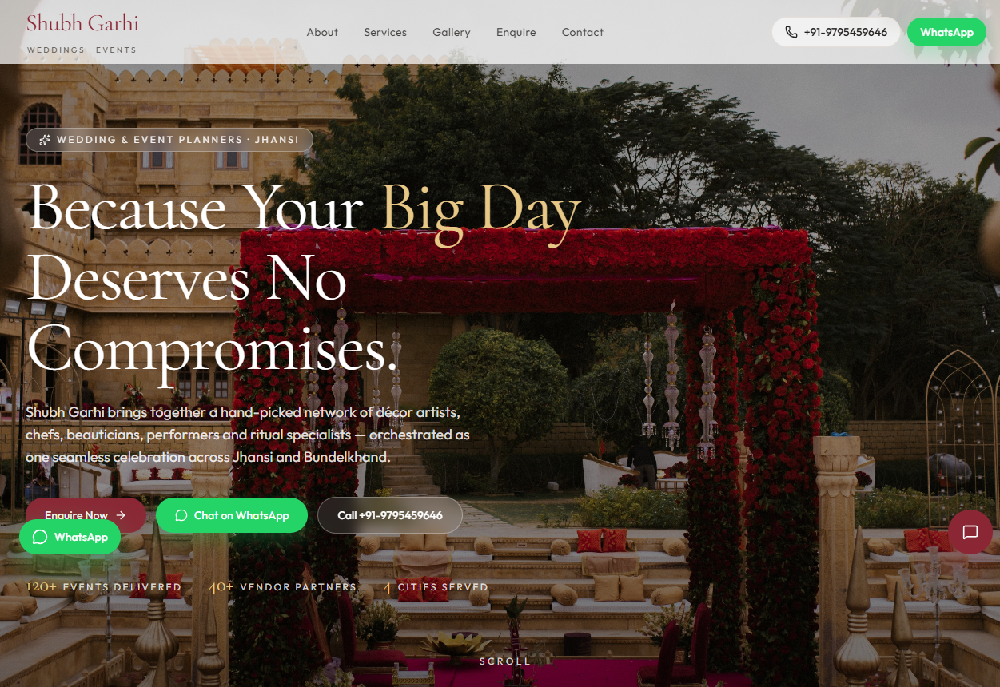
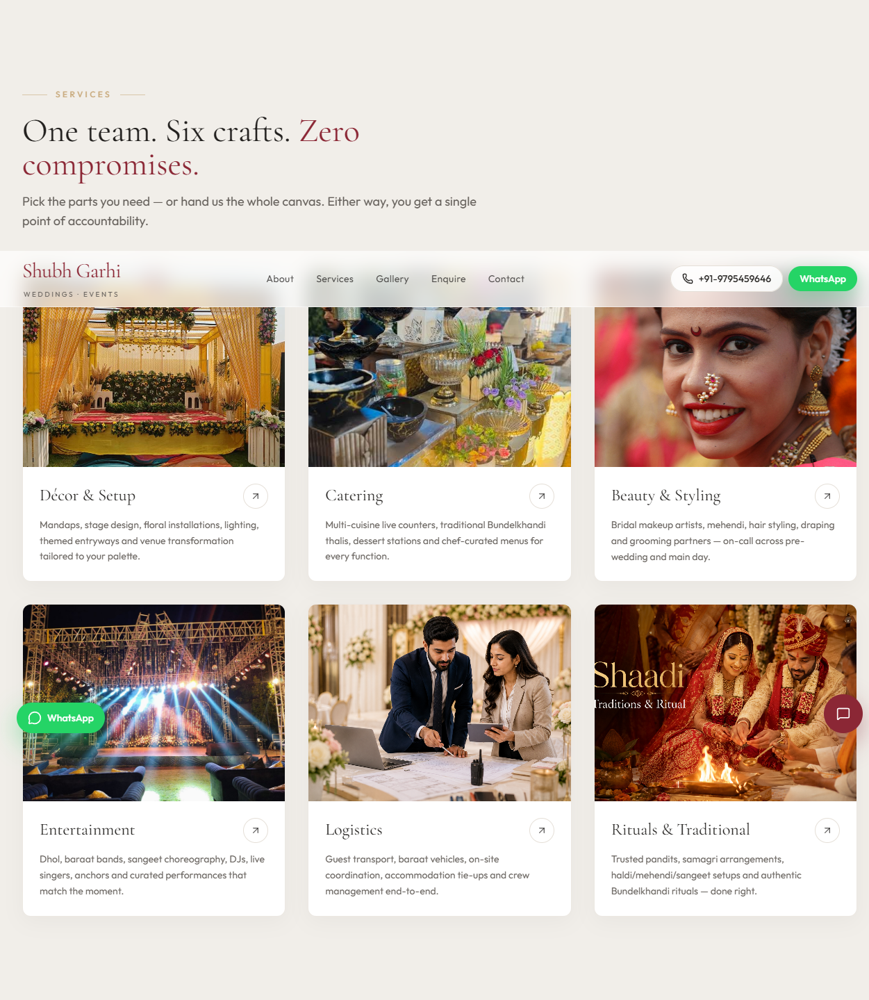
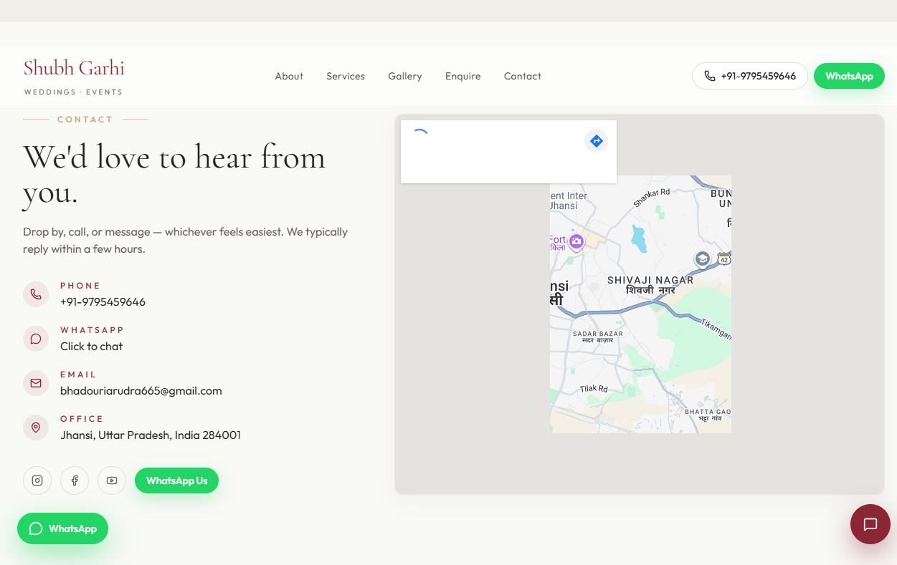

# Shubh Garhi Frontend

Modern marketing website for **Shubh Garhi**, a wedding and event planning business based in Jhansi.

The site presents the brand story, service offerings, gallery, enquiry form, contact details, a sticky WhatsApp shortcut, and a lightweight chatbot-style lead capture panel.

## ✨ Highlights

- Elegant, mobile-first landing page
- Hero section with strong branding and calls to action
- About, services, gallery, enquiry, and contact sections
- Floating WhatsApp button and chatbot entry point
- Responsive UI with a warm wedding-themed color palette
- SEO-friendly metadata and structured content

## 🖼 Screenshots

### Hero



### Services



### Contact



## 🧰 Tech stack

- React 19
- Vite
- Tailwind CSS
- Axios
- Sonner
- Lucide React

## 📁 Project structure

- `src/main.jsx` — app bootstrap
- `src/App.jsx` — top-level page composition
- `src/index.css` — theme tokens and shared styles
- `src/components/site/` — site sections and widgets
- `src/lib/siteConfig.js` — brand, contact, and location data
- `public/screenshots/` — captured preview images for the README

## 🚀 Getting started

### Prerequisites

- Node.js 18+ recommended
- npm

### Install dependencies

```bash
npm install
```

### Run locally

```bash
npm run dev
```

By default the app runs on Vite's local dev server.

### Build for production

```bash
npm run build
```

### Preview the production build

```bash
npm run preview
```

## ⚙️ Environment variables

The frontend reads the backend URL from:

- `VITE_BACKEND_URL`

If it is not set, the app falls back to `/api`.

Example:

```bash
VITE_BACKEND_URL=http://localhost:8000
```

## 🌐 Content sources

Most business details live in `src/lib/siteConfig.js`, including:

- brand name
- founder names
- phone and WhatsApp
- email
- office address
- service areas

Update that file to refresh the entire site copy in one place.

## Notes

- The screenshots in this README are taken from the live app.
- The project uses Tailwind-based utility classes, so keep `src/index.css` and the Tailwind config in sync if you make visual changes.
